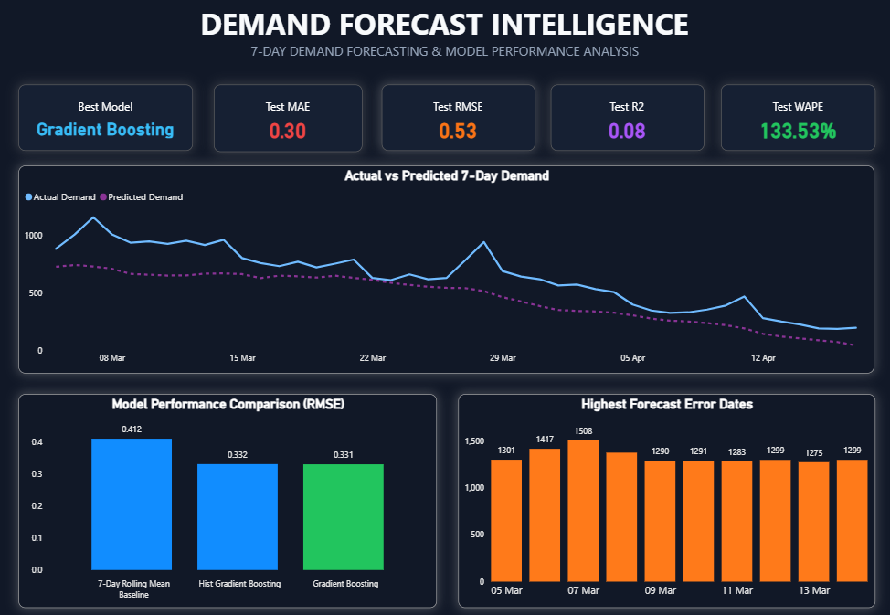
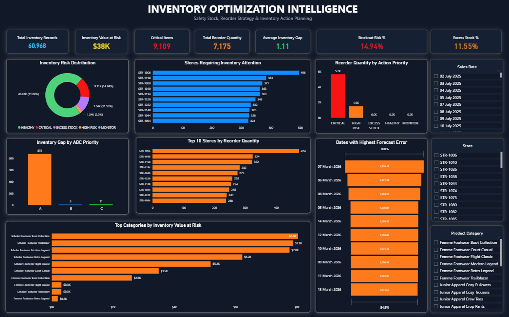
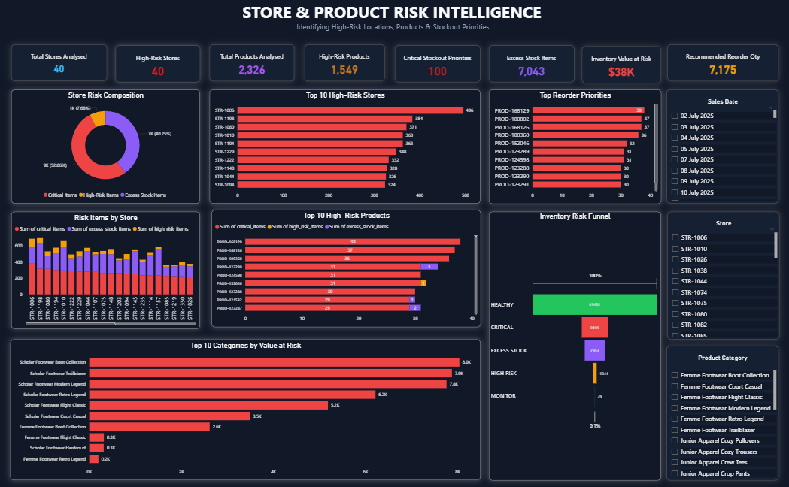
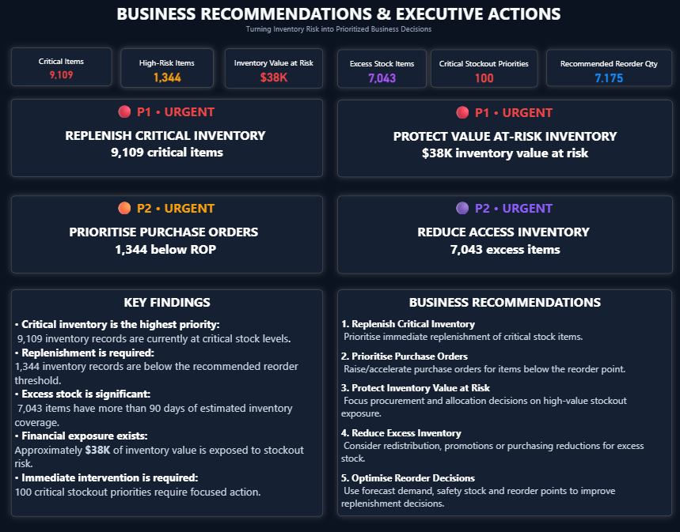

# StockSenseAI — AI-Powered Demand Forecasting & Inventory Intelligence

> **From raw retail data to demand forecasts, inventory optimization, and actionable business decisions.**

<p align="center">

[](https://stocksense-ai-demand-forecasting-inventory-intelligence-urlth3.streamlit.app/)
[](https://www.python.org/)
[](https://www.postgresql.org/)
[](https://streamlit.io/)
[](https://scikit-learn.org/)
[](LICENSE)

</p>

<p align="center">
  <a href="https://stocksense-ai-demand-forecasting-inventory-intelligence-urlth3.streamlit.app/"><strong>🚀 Launch Live Application</strong></a>
  &nbsp; • &nbsp;
  <a href="#-project-overview"><strong>Explore Project</strong></a>
  &nbsp; • &nbsp;
  <a href="#-technology-stack"><strong>Technology Stack</strong></a>
</p>

---

## 🚀 Live Application

### 👉 [Launch StockSenseAI](https://stocksense-ai-demand-forecasting-inventory-intelligence-urlth3.streamlit.app/)

**StockSenseAI is an end-to-end AI-powered inventory decision-support platform designed to transform retail sales and inventory data into actionable supply chain intelligence.**

The platform combines:

* 📈 Demand forecasting
* 📦 Inventory optimization
* ⚠️ Stockout and excess-stock risk detection
* 🎯 Dynamic reorder recommendations
* 💰 Financial risk prioritization
* 💡 Executive-level business insights

---

# 🎯 Project Overview

Retail and supply chain teams often face a difficult balancing act:

> **Too little inventory → Stockouts, lost revenue, dissatisfied customers.**
> **Too much inventory → Excess working capital, storage costs, and inefficient operations.**

StockSenseAI bridges this gap by transforming historical retail data into a complete decision pipeline:

```text
                    ┌─────────────────────┐
                    │   Retail Raw Data   │
                    └──────────┬──────────┘
                               │
                               ▼
                    ┌─────────────────────┐
                    │ PostgreSQL + SQL    │
                    │ Data Engineering    │
                    └──────────┬──────────┘
                               │
                               ▼
                    ┌─────────────────────┐
                    │ Feature Engineering │
                    │ Time-Series Signals │
                    └──────────┬──────────┘
                               │
                               ▼
                    ┌─────────────────────┐
                    │  ML Demand Forecast │
                    │   7-Day Horizon     │
                    └──────────┬──────────┘
                               │
                               ▼
                    ┌─────────────────────┐
                    │ Inventory Optimizer │
                    │ SS • ROP • DOI      │
                    └──────────┬──────────┘
                               │
                               ▼
                    ┌─────────────────────┐
                    │ Risk Classification │
                    │ Critical → Healthy  │
                    └──────────┬──────────┘
                               │
                               ▼
                    ┌─────────────────────┐
                    │ Business Decisions  │
                    │ Reorder • Monitor   │
                    └─────────────────────┘
```

---

# 💼 Business Problem

Managing inventory across thousands of products and multiple store locations creates three major challenges.

### 🔴 Stockout Risk

Insufficient inventory can lead to:

* Lost sales
* Unfulfilled customer demand
* Reduced customer satisfaction
* Potential brand damage

### 🟠 Excess Inventory

Overstocking can result in:

* Capital locked in inventory
* Higher storage costs
* Product depreciation or obsolescence
* Reduced operational flexibility

### 🟡 Prioritization Complexity

When thousands of Store × Product combinations must be monitored simultaneously, manual spreadsheet analysis becomes inefficient and difficult to scale.

---

# 💡 The StockSenseAI Solution

StockSenseAI converts machine learning forecasts into **inventory actions**.

Instead of simply answering:

> *“What will demand look like?”*

The platform helps answer:

> **What should we order? Which items are at risk? How much inventory is required? Where should managers focus first?**

The workflow is:

```text
Historical Sales
       ↓
Time-Series Feature Engineering
       ↓
Machine Learning Forecast
       ↓
7-Day Demand Prediction
       ↓
Safety Stock Calculation
       ↓
Dynamic Reorder Point
       ↓
Inventory Risk Classification
       ↓
Recommended Reorder Quantity
       ↓
Executive Business Recommendations
```

---

# ✨ Key Features

## 📈 1. Demand Forecast Intelligence

Generates **7-day demand forecasts** at the native:

> **Store × Product**

planning level.

The forecasting workflow incorporates:

* Historical demand patterns
* Lag features
* Rolling demand averages
* Demand volatility
* Calendar features
* Product demand characteristics
* Store-level signals

### Core Demand Metrics

| Metric                | Description                           |
| --------------------- | ------------------------------------- |
| **7-Day Forecast**    | Predicted demand over the next 7 days |
| **Daily Demand**      | Average expected daily demand         |
| **Rolling Demand**    | Recent demand trend                   |
| **Demand Volatility** | Historical variability in demand      |

---

## 📦 2. Inventory Optimization Engine

The platform translates demand predictions into operational inventory thresholds.

### Lead-Time Demand

Expected demand during supplier lead time:

```text
LTD = Daily Demand × Lead Time
```

### Safety Stock

A demand volatility buffer designed to protect service levels:

```text
SS = Z × σ × √Lead Time
```

Where:

* `Z = 1.65`
* Target service level ≈ **95%**
* `σ` = demand volatility

### Reorder Point

```text
ROP = Lead-Time Demand + Safety Stock
```

### Days of Inventory

```text
DOI = Inventory Quantity / Daily Demand
```

---

# ⚠️ Inventory Risk Classification

Each Store × Product inventory position is automatically classified into one of five business risk categories.

| Risk Tier           | Condition            | Business Meaning                     | Recommended Action                      |
| ------------------- | -------------------- | ------------------------------------ | --------------------------------------- |
| 🔴 **CRITICAL**     | Qty ≤ 0              | Active stockout                      | Immediate replenishment                 |
| 🟠 **HIGH RISK**    | Qty ≤ ROP or DOI < 7 | Inventory approaching critical level | Prioritize reorder                      |
| 🟡 **MONITOR**      | 7 ≤ DOI < 21         | Low inventory buffer                 | Monitor closely                         |
| 🟢 **HEALTHY**      | Normal coverage      | Balanced inventory                   | No immediate action                     |
| 🔵 **EXCESS STOCK** | DOI > 90             | Significant overstock                | Review purchasing or redistribute stock |

---

# 📊 Business Impact

StockSenseAI analyzes:

## **60,968 Store × Product inventory records**

and transforms them into prioritized supply chain decisions.

| Business Metric                 |          Result |
| ------------------------------- | --------------: |
| 📦 Total Inventory Records      |      **60,968** |
| 🔴 Critical Items               |       **9,109** |
| 🟠 High-Risk Items              |       **1,344** |
| 🔵 Excess Stock Items           |       **7,043** |
| 💰 Inventory Value at Risk      |  **$38,141.50** |
| 🔄 Recommended Reorder Quantity | **7,175 units** |
| 🧪 Validation Tests Passed      |     **20 / 20** |

### Why this matters

Instead of manually reviewing **60,000+ inventory positions**, decision-makers can immediately focus on:

* Critical stockouts
* High-priority replenishment
* Financial value at risk
* Excess inventory exposure
* Store-level risk
* Product-level actions

---

# 🖥️ Application Dashboard

The Streamlit application provides an interactive decision-support interface.

## 📈 Demand Forecast

Explore predicted demand patterns and forecasting intelligence.



---

## 📦 Inventory Optimization

Analyze safety stock, reorder points, inventory gaps, and days of inventory.



---

## ⚠️ Risk & Action Center

Identify critical inventory positions and prioritize actions based on risk and financial exposure.



---

## 💡 Insights & Recommendations

Transform analytical outputs into executive-level business recommendations.



---

# 🏗️ Project Architecture

```text
StockSenseAI/
│
├── analysis/
│   ├── 01_business_exploration.py
│   ├── 02b_feature_engineering_timeseries.py
│   ├── 03b_demand_forecasting_model.py
│   ├── 04_inventory_optimization.py
│   └── 05_business_recommendations.py
│
├── data/
│   └── processed/
│
├── models/
│   ├── best_demand_forecasting_model_timeseries.pkl
│   └── model_features_timeseries.pkl
│
├── notebooks/
│
├── results/
│   └── inventory_optimization_recommendations.csv
│
├── docs/
│   └── screenshots/
│
├── sql/
│   ├── 01_create_staging_tables.sql
│   ├── 02_staging_validation.sql
│   ├── 03_create_core_tables.sql
│   ├── 04_load_core_tables.sql
│   ├── 05_core_data_validation.sql
│   ├── 06_create_analytics_views.sql
│   └── 07_analytics_validation.sql
│
├── streamlit/
│   ├── app.py
│   ├── pages/
│   ├── utils/
│   └── assets/
│
├── requirements.txt
├── LICENSE
└── README.md
```

---

# 🧠 Machine Learning Workflow

```text
Raw Retail Data
      ↓
Data Cleaning & Validation
      ↓
PostgreSQL Data Modeling
      ↓
SQL Analytics Views
      ↓
Time-Series Expansion
      ↓
Feature Engineering
      ↓
Train / Validation / Test Split
      ↓
Model Training & Evaluation
      ↓
Demand Forecast Generation
      ↓
Inventory Optimization
      ↓
Business Recommendation Engine
      ↓
Streamlit Decision Platform
```

---

# 🛠️ Technology Stack

| Category                   | Technologies              |
| -------------------------- | ------------------------- |
| 🐍 Programming             | Python                    |
| 🗄️ Database               | PostgreSQL                |
| 📊 Data Analysis           | Pandas, NumPy             |
| 🧠 Machine Learning        | scikit-learn              |
| 🕒 Time-Series Engineering | Lag & Rolling Features    |
| 🔗 Database Integration    | SQLAlchemy                |
| 📈 Visualization           | Plotly                    |
| 🖥️ Application            | Streamlit                 |
| ☁️ Deployment              | Streamlit Community Cloud |
| 🔧 Version Control         | Git & GitHub              |

---

# 🧪 Validation & Quality Assurance

The production application passed:

## 🟢 **20 / 20 Automated Validation Tests**

Validation includes:

* Production dataset loading
* Required column verification
* Store × Product grain uniqueness
* Risk category validation
* Critical inventory reconciliation
* High-risk inventory reconciliation
* Excess stock reconciliation
* Financial value-at-risk validation
* Recommended reorder quantity validation
* Non-negative reorder verification
* Inventory metric validation
* Application navigation checks
* Insights page availability
* Production CSV integrity
* Python compilation checks

```text
============================================================
FINAL RESULT: 20 PASSED, 0 FAILED
============================================================
```

---

# 🚀 Run Locally

## 1️⃣ Clone the repository

```bash
git clone https://github.com/YOUR_USERNAME/StockSenseAI.git
```

```bash
cd StockSenseAI
```

## 2️⃣ Create a virtual environment

```bash
python -m venv venv
```

### Windows

```bash
venv\Scripts\activate
```

### macOS / Linux

```bash
source venv/bin/activate
```

## 3️⃣ Install dependencies

```bash
pip install -r requirements.txt
```

## 4️⃣ Launch the application

```bash
streamlit run streamlit/app.py
```

The application will be available locally through Streamlit.

---

# 🌐 Deployment

The application is publicly deployed using Streamlit Community Cloud.

### 🚀 **[Launch StockSenseAI Live](https://stocksense-ai-demand-forecasting-inventory-intelligence-urlth3.streamlit.app/)**

---

# 🎯 Skills Demonstrated

This project demonstrates practical experience across the complete data and machine learning lifecycle.

### Data Engineering

* Data cleaning
* Data validation
* Data modeling
* PostgreSQL
* SQL analytics views

### Data Analytics

* Exploratory analysis
* KPI development
* Inventory analysis
* Business intelligence
* Risk prioritization

### Machine Learning

* Time-series feature engineering
* Demand forecasting
* Model evaluation
* Feature selection
* Production model serialization

### Supply Chain Analytics

* Safety stock optimization
* Reorder point calculation
* Lead-time demand
* Days of inventory
* Inventory risk classification

### Data Applications

* Streamlit
* Interactive dashboards
* Plotly
* Production-style data pipelines
* Cloud deployment

---

# 🔮 Future Improvements

Potential next steps include:

* 🔄 Variable supplier lead times
* 🌍 Multi-location inventory transfers
* 🏭 Supplier-level service performance modeling
* 📦 Automated purchase order recommendations
* 📡 Real-time data pipelines
* ☁️ Cloud database integration
* 🤖 Advanced forecasting models
* 🔔 Automated inventory risk alerts
* 📈 Forecast monitoring and drift detection

---

# ⚠️ Current Limitations

* Supplier lead time is currently modeled using a fixed **7-day horizon**.
* Recommendations are generated using batch predictions.
* The deployed dashboard uses processed production outputs rather than a live transactional database.
* Future versions could incorporate real-time inventory updates and dynamic supplier performance.

---

# 👨‍💻 Author

**Yash Prajapati**

Data Science | Machine Learning | Data Analytics | Business Intelligence

If you found this project interesting, consider:

⭐ **Starring the repository**
🍴 **Forking the project**
🔗 **Connecting on LinkedIn**
🚀 **Sharing StockSenseAI with others interested in Data, AI, Retail, or Supply Chain Analytics**

---

<p align="center">

### ⭐ If you like this project, consider giving it a star!

**Built to demonstrate how data, machine learning, and business intelligence can work together to support better inventory decisions.**

[](https://stocksense-ai-demand-forecasting-inventory-intelligence-urlth3.streamlit.app/)

</p>

## 🏷️ Topics

```text
data-science machine-learning demand-forecasting inventory-optimization
supply-chain-analytics time-series-forecasting retail-analytics
postgresql python streamlit plotly scikit-learn data-analytics
business-intelligence inventory-management predictive-analytics
end-to-end-data-science
```
